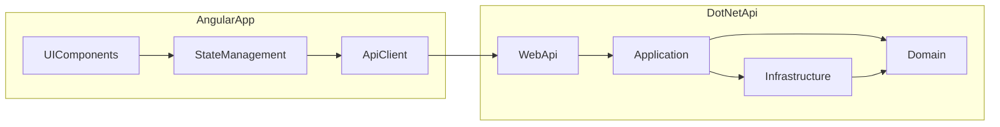

# ELearning Build Plan (.NET Clean Architecture + Angular)

## Scope

- Full: course management, students, instructors, enrollment, lesson content, quiz, certificates, payments, reports, notifications.
- Empty repo: start architecture and modules from scratch.

## High-level Architecture

- **Backend**: .NET (Clean Architecture) with `Domain` / `Application` / `Infrastructure` / `WebApi`.
- **Data & queries**: Generic Repository + UnitOfWork, AutoMapper + `ProjectTo` for query projection.
- **Observability**: Audit trail (who/when/what), structured logging, correlation id.
- **Frontend**: Angular (feature modules + shared + core).
- **Communication**: REST API (realtime notifications can be added later).

## Proposed Folder Structure

- Backend
  - `backend/src/Domain`
  - `backend/src/Application`
  - `backend/src/Infrastructure`
  - `backend/src/WebApi`
- Frontend
  - `frontend/src/app/core`
  - `frontend/src/app/shared`
  - `frontend/src/app/features/*`
- Docs
  - `docs/architecture.md`
  - `docs/api.md`
  - `docs/frontend.md`

## Delivery Phases

### 1) Foundation

- Create .NET solution with Clean Architecture structure.
- Set up Angular workspace with `core/shared/features` modules.
- Configure code style, linting, basic CI.

### 2) Domain + Use Cases (BE)

- Core entities and sub-entities: Course, Section, Lesson, Instructor, Student, Enrollment, Quiz, Question, Attempt, Certificate, Payment, Notification, Report, Attachment, Progress, Review, Tag, Category.
- Value Objects: Money, Email, Duration, QuizScore, CourseStatus.
- Use cases: CRUD course, enrollment, publish course, assign instructor, take quiz, issue certificate, payment flow, reporting.

### 3) API + Infrastructure

- DbContext + migrations (SQL Server/Postgres).
- Generic Repository + UnitOfWork.
- Mapping: AutoMapper profiles + `ProjectTo` for optimized queries.
- REST endpoints by resource.
- AuthN/AuthZ (JWT + roles: Admin/Instructor/Student).
- Audit trail (created/updated/by, soft delete, change log).
- Logging (Serilog/OpenTelemetry), correlation id, error handling.
- Payment provider integration (Stripe/VNPay) via abstraction.
- Notification service (email + in-app).

### 4) Frontend Features

- Auth module: login/register/roles.
- Course management: list, detail, create/edit, publish.
- Learning: lesson viewer, progress tracking.
- Quiz: take quiz, view results.
- Certificates: view/download.
- Payments: checkout, history.
- Reports: dashboard/analytics.

### 5) Quality & Docs

- Unit/integration tests (BE), component tests (FE).
- Update docs: architecture, API contract, FE module map.

## Documentation to Update

- `docs/architecture.md`: Clean Architecture, data flow, dependency rules.
- `docs/api.md`: endpoints + request/response samples.
- `docs/frontend.md`: module structure, routing, state.
- `docs/data-access.md`: generic repository, UoW, mapping, `ProjectTo`, audit.

## Risks & Assumptions

- Assumed DB: Postgres (can be changed).
- Payment provider to be confirmed.

## Todos

- Initialize BE/FE structure and toolchain.
- Design domain model + core use cases.
- Build API + persistence + auth + audit/log/mapping.
- Build FE modules by feature.
- Add tests and update docs.
