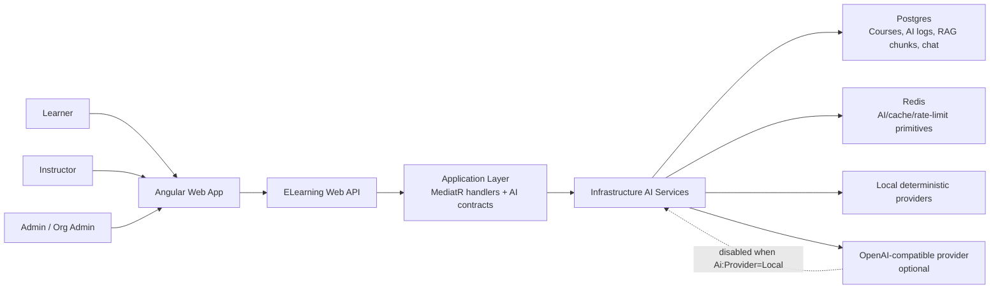
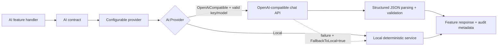
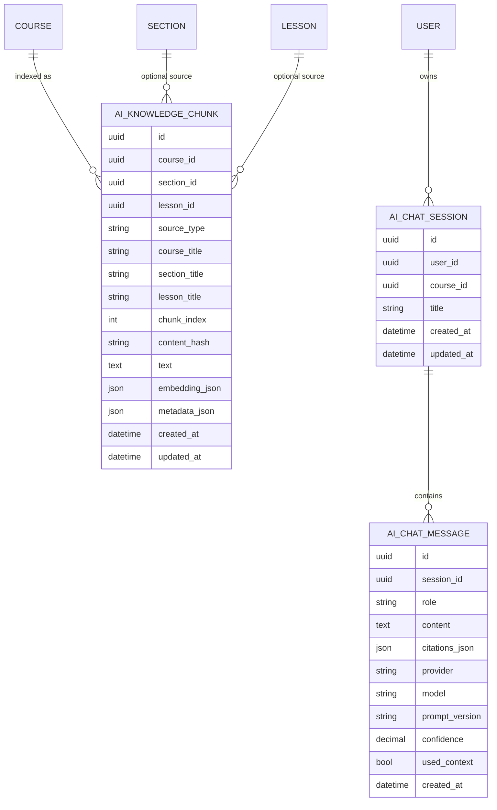
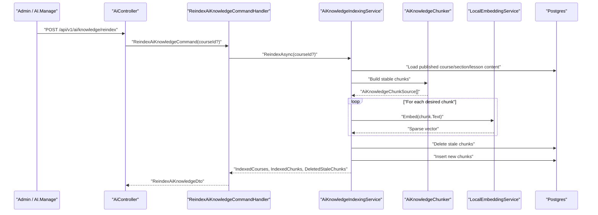
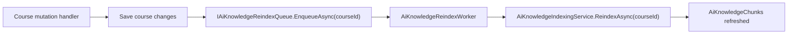
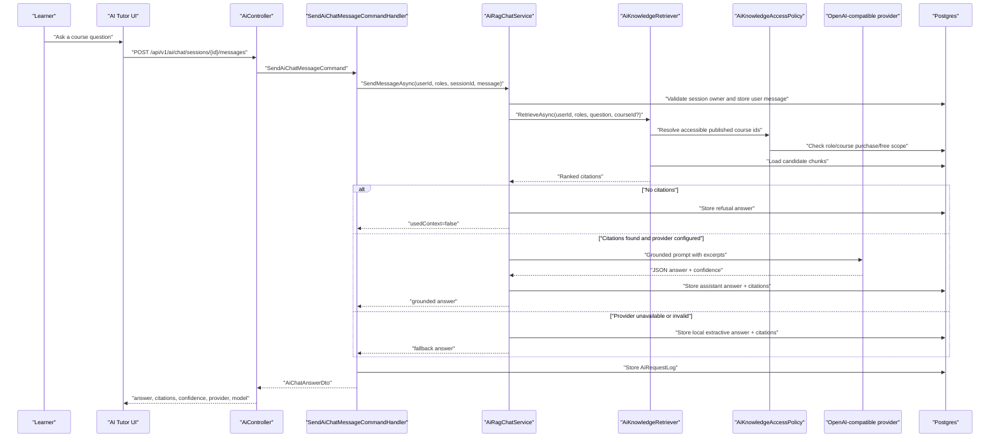

# AI Architecture

This document describes the deployed AI architecture in the ELearning platform: feature boundaries, provider strategy, RAG design, data model, runtime flows, security controls, and operational entry points.

Related documents:

- [AI/RAG Foundation](./ai-rag-foundation.md)
- [AI/RAG Runbook](./ai-rag-runbook.md)
- [AI Quality Evaluation](./ai-quality-evaluation.md)
- [AI-6 Completion - RAG Learning Assistant](./ai6-completion.md)

## Current AI Feature Set

| Code | Feature | Primary user | Current implementation |
| --- | --- | --- | --- |
| AI-1 | Quiz question generation | Instructor | Local deterministic provider or OpenAI-compatible provider |
| AI-2 | Course recommendation | Learner | Local deterministic scoring |
| AI-3 | Essay grading assistant | Instructor | Local deterministic provider or OpenAI-compatible provider |
| AI-4 | Learner risk prediction | Instructor/Admin | Local deterministic scoring |
| AI-5 | Semantic course search | Learner | Local deterministic sparse embeddings |
| AI-5 | Learning path generation | Learner | Local deterministic provider or OpenAI-compatible provider |
| AI-6 | RAG Learning Assistant | Learner | JSON-vector retrieval, local extractive fallback, optional OpenAI-compatible answer synthesis |

## Architectural Principles

- The Application layer owns AI contracts and feature handlers.
- The Infrastructure layer owns local deterministic providers, external provider adapters, RAG retrieval/indexing, and persistence integration.
- AI output is assistive: suggestions, drafts, recommendations, or grounded answers. AI does not directly mutate grades, progress, orders, enrollments, or certificates.
- Local deterministic providers are the default so the app works without provider credentials.
- External provider integration is OpenAI-compatible HTTP first. Azure-specific endpoint mode is a follow-up.
- Prompt versions, provider/model metadata, input hashes, status, and token estimates are logged for auditability.
- RAG answers must be grounded in retrieved course chunks and return citations.

## System Context

## Component Architecture

```mermaid
flowchart TB
    subgraph Application["ELearning.Application"]
        AiHandlers["Features/Ai handlers"]
        AiContracts["Common/Interfaces<br/>AI contracts"]
        CourseHandlers["Course mutation handlers"]
    end

    subgraph InfrastructureAI["ELearning.Infrastructure/Ai"]
        Shared["AiOptions<br/>AiRequestLogRepository"]

        subgraph Local["Local"]
            LocalQuiz["LocalQuizQuestionGenerator"]
            LocalEssay["LocalEssayGradingService"]
            LocalPath["LocalLearningPathService"]
            LocalSearch["LocalSemanticSearchService"]
            LocalRisk["LocalLearnerRiskService"]
            LocalReco["LocalCourseRecommendationService"]
            LocalEmbedding["LocalEmbeddingService"]
        end

        subgraph Providers["Providers"]
            ConfigQuiz["ConfigurableAiQuizQuestionGenerator"]
            ConfigEssay["ConfigurableAiEssayGradingService"]
            ConfigPath["ConfigurableAiLearningPathService"]
            ChatClient["OpenAiCompatibleChatClient"]
        end

        subgraph Rag["Rag"]
            Chunker["AiKnowledgeChunker"]
            Indexing["AiKnowledgeIndexingService"]
            Queue["InMemoryAiKnowledgeReindexQueue"]
            Worker["AiKnowledgeReindexWorker"]
            Policy["AiKnowledgeAccessPolicy"]
            Retriever["AiKnowledgeRetriever"]
            Chat["AiRagChatService"]
        end
    end

    AiHandlers --> AiContracts
    CourseHandlers --> Queue
    AiContracts --> Local
    AiContracts --> Providers
    AiContracts --> Rag

    ConfigQuiz --> LocalQuiz
    ConfigQuiz --> ChatClient
    ConfigEssay --> LocalEssay
    ConfigEssay --> ChatClient
    ConfigPath --> LocalPath
    ConfigPath --> ChatClient

    Indexing --> Chunker
    Indexing --> LocalEmbedding
    Retriever --> Policy
    Retriever --> LocalEmbedding
    Chat --> Retriever
    Chat --> ChatClient
    Worker --> Indexing
```

## Application Layer Contracts

AI service contracts live in `src/ELearning.Application/Common/Interfaces`.

Key contracts:

- `IAiQuizQuestionGenerator`
- `IAiEssayGradingService`
- `IAiLearningPathService`
- `IAiSemanticSearchService`
- `IAiLearnerRiskService`
- `IAiCourseRecommendationService`
- `IAiEmbeddingService`
- `IAiRagChatService`
- `IAiKnowledgeIndexingService`
- `IAiKnowledgeRetriever`
- `IAiKnowledgeReindexQueue`
- `IAiRequestLogRepository`

AI feature handlers live under `src/ELearning.Application/Features/Ai/*`.
Handlers validate request shape, resolve current user context, call AI contracts, and persist audit metadata where applicable.

## Infrastructure Layout

| Folder | Responsibility |
| --- | --- |
| `src/ELearning.Infrastructure/Ai` | Shared options and AI request log repository |
| `src/ELearning.Infrastructure/Ai/Local` | Offline deterministic AI providers and local embedding implementation |
| `src/ELearning.Infrastructure/Ai/Providers` | Configurable provider selectors and OpenAI-compatible HTTP adapter |
| `src/ELearning.Infrastructure/Ai/Rag` | Chunking, indexing, queue/worker, access policy, retriever, chat orchestration |

The namespace remains `ELearning.Infrastructure.Ai` to avoid leaking folder layout into consumers.

## Provider Strategy

Current provider rules:

- `Provider=Local` is default.
- `Provider=OpenAiCompatible` requires `ApiKey` and `ChatModel` for remote calls.
- `FallbackToLocal=true` keeps workflows usable if the remote provider fails.
- RAG v1 uses the remote provider only for answer synthesis.
- Embeddings remain local deterministic sparse vectors in this sprint.

## Configuration

AI options are bound from the `Ai` configuration section.

| Option | Default | Purpose |
| --- | --- | --- |
| `Provider` | `Local` | Provider selector: `Local` or `OpenAiCompatible` |
| `Model` | `local-deterministic-v1` | Local/default model metadata |
| `BaseUrl` | `https://api.openai.com/v1` | OpenAI-compatible API base URL |
| `ApiKey` | empty | Provider secret, must come from env/user-secrets |
| `ChatModel` | empty | Remote chat model name |
| `TimeoutSeconds` | `30` | HTTP provider timeout |
| `MaxOutputTokens` | `1200` | Remote response cap |
| `MaxRetries` | `2` | Provider retry count |
| `FallbackToLocal` | `true` | Use local fallback when provider fails |
| `QuizQuestionPromptVersion` | `quiz-question-generator-v1` | Quiz prompt audit version |
| `EssayGradingPromptVersion` | `essay-grading-v1` | Essay prompt audit version |
| `LearningPathPromptVersion` | `learning-path-generator-v1` | Learning path prompt audit version |
| `RagChatPromptVersion` | `rag-learning-assistant-v1` | RAG prompt audit version |
| `RagMaxRetrievedChunks` | `4` | Top retrieved chunks used for RAG |
| `RagMinSimilarity` | `0.05` | Minimum cosine similarity for retrieved chunks |
| `MaxSourceCharacters` | `12000` | Source-content cap for provider prompts |

Secrets must not be committed to `appsettings*.json`. Use environment variables such as `Ai__Provider`, `Ai__ApiKey`, and `Ai__ChatModel`.

## RAG Data Model

RAG v1 stores embeddings as JSON-serialized sparse vectors in Postgres and calculates cosine similarity in application code. `IAiKnowledgeRetriever` is the seam for moving to `pgvector`, a vector cache, or an external vector database later.

## Knowledge Indexing Flow

Background reindex is also triggered after course mutations:

- publish course
- update published course
- add section to published course
- add lesson to published course
- delete course

## Learner Chat Flow

## Access Control and Data Boundaries

| Boundary | Rule |
| --- | --- |
| AI endpoints | Require authentication and permission attributes |
| Chat sessions | Current user can list/read/send only inside own sessions |
| Course-scoped chat session | Course must be published and accessible to the user |
| RAG retrieval for privileged roles | Admin, Instructor, OrgAdmin can retrieve from all published courses |
| RAG retrieval for learner | Learner can retrieve from published free courses and paid course/class purchases |
| Knowledge reindex | Requires `AI.Manage` |
| Provider secrets | Environment/user-secrets only, not committed appsettings |
| Provider prompts | Avoid unnecessary PII; prefer course excerpts and request metadata |

## Guardrails

- RAG refuses when no retrieved context is available.
- RAG citations are generated only from retrieved `AiKnowledgeChunk` rows.
- Provider answer confidence is clamped between `0` and `1`.
- Invalid provider JSON falls back to local extractive answers when fallback is enabled.
- Authoring/grading/path outputs remain drafts or suggestions.
- AI request metadata is logged for review and troubleshooting.

## Public API Surface

`src/ELearning.WebApi/Controllers/v1/AiController.cs` exposes:

- `GET /api/v1/ai/recommendations/courses`
- `GET /api/v1/ai/search/courses`
- `POST /api/v1/ai/learning-paths/generate`
- `POST /api/v1/ai/chat/sessions`
- `GET /api/v1/ai/chat/sessions`
- `GET /api/v1/ai/chat/sessions/{sessionId}/messages`
- `POST /api/v1/ai/chat/sessions/{sessionId}/messages`
- `POST /api/v1/ai/knowledge/reindex`
- `POST /api/v1/ai/quizzes/generate-questions`
- `POST /api/v1/ai/quizzes/attempts/{attemptId}/grade-suggestions`
- `GET /api/v1/ai/learners/{userId}/risk`
- `GET /api/v1/ai/organizations/{organizationId}/risk-report`

## Frontend Integration

Angular API bindings live in:

- `frontend/web/src/app/core/api/lms-api.service.ts`

Learner-facing RAG chat UI lives in:

- `frontend/web/src/app/features/learn/ai-chat.component.ts`

The UI should present AI as a professional assistant:

- show `AI-generated suggestion` or equivalent label where appropriate
- show citations as reference cards/footnotes
- show provider/confidence metadata where useful
- avoid implying the AI answer is authoritative without course evidence

## Observability

`AiRequestLog` stores:

- feature name
- provider
- model
- prompt version
- input hash
- token estimate
- status
- error message when failed

For RAG, `AiChatMessage` also stores answer content, citations JSON, provider/model/prompt metadata, confidence, and whether context was used.

## Known Limits

- RAG vectors are JSON in Postgres, not `pgvector`.
- Retrieval is app-side cosine similarity, not ANN/vector-index accelerated.
- Embeddings are local deterministic sparse vectors.
- External provider integration is OpenAI-compatible chat only.
- No provider-side embedding adapter yet.
- No admin UI for AI logs/RAG reindex status yet.
- Background reindex queue is in-memory and suitable for current app/runtime, not distributed workers.

## Follow-Up Architecture Work

- Replace JSON vector store with `pgvector` or a vector-cache design.
- Add OpenAI-compatible embedding adapter behind `IAiEmbeddingService`.
- Add distributed reindex jobs if the API is horizontally scaled.
- Add admin AI observability UI: request logs, token usage, provider errors, reindex history.
- Add automated RAG quality dataset and regression scoring.
