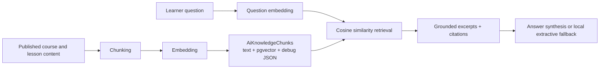

# AI/RAG Foundation

This document explains the core AI and RAG concepts used in this codebase. It is intentionally implementation-aware: the goal is to help backend, frontend, QA, and product contributors reason about the current system without needing prior LLM/RAG experience.

## Mental Model

The platform has two classes of AI features:

1. **Deterministic local AI**
   - Runs without an external provider.
   - Uses rule-based scoring, local embeddings, templates, and extractive responses.
   - Good for demos, predictable tests, and fallback behavior.

2. **Provider-assisted AI**
   - Uses an OpenAI-compatible HTTP chat provider when configured.
   - Used for richer language generation in quiz generation, essay grading suggestions, learning path drafting, and RAG answer synthesis.
   - Must always be validated, bounded, logged, and recoverable.

RAG belongs to the second category only when provider synthesis is enabled. The retrieval step is still local in v1.

## What RAG Means Here

RAG means **Retrieval-Augmented Generation**.

In this LMS, RAG answers learner questions by:

1. Turning published course/lesson content into searchable chunks.
2. Turning the learner question into a vector.
3. Finding the most relevant stored chunks.
4. Building a prompt with only those retrieved excerpts.
5. Asking the provider to answer only from those excerpts.
6. Returning citations pointing back to the source chunks.

If no relevant chunks are retrieved, the assistant refuses instead of guessing.

## Chunking

Chunking splits source content into smaller units that can be retrieved independently.

Current source material:

- course title
- course description
- section title
- lesson title
- lesson content

Current chunking behavior:

- chunks are stable across repeated indexing runs
- chunk order is deterministic
- chunk text is normalized
- chunks are limited by max character size
- every chunk gets a content hash

Why chunking matters:

- chunks that are too large reduce retrieval precision
- chunks that are too small lose context
- stable chunking makes reindex idempotent and avoids unnecessary churn

## Content Hash

Each indexed chunk has a `ContentHash`.

The hash is derived from:

- course id
- section id
- lesson id
- source type
- chunk index
- titles
- chunk text

The indexer compares desired hashes with stored hashes:

- hash still exists: keep the chunk
- hash new: insert the chunk
- hash no longer desired: delete stale chunk

This makes reindexing idempotent.

## Embeddings

An embedding is a numeric representation of text.

In production RAG systems, embeddings are often dense vectors from a model. The app now uses local deterministic dense vectors for RAG:

- text is tokenized
- tokens are hashed into a fixed 384-dimensional vector
- vectors are L2-normalized
- vectors are stored in Postgres `embedding_vector vector(384)`
- `embedding_json` is kept as debug/backward compatibility data
- similarity is computed through pgvector cosine distance

This is less semantically powerful than a real embedding model, but it is:

- deterministic
- offline
- easy to test
- enough for demo and architectural validation

## Cosine Similarity

Cosine similarity measures whether two vectors point in a similar direction.

In this app:

- learner question becomes a vector
- each stored chunk has a vector
- retriever computes similarity between the question and each candidate chunk
- higher score means more relevant

The retriever then applies:

- `RagMinSimilarity`: minimum accepted score
- `RagMaxRetrievedChunks`: maximum number of citations/context chunks

## Top-K Retrieval

Top-k retrieval means taking the best `k` chunks after ranking.

Example:

- `RagMaxRetrievedChunks=4`
- retriever ranks 30 candidate chunks
- only the best 4 are used in the answer prompt and returned as citations

Top-k matters because too much context:

- increases token usage
- can distract the model
- makes citations noisy

Too little context:

- causes refusals
- misses necessary explanation
- weakens answer quality

## Grounding

Grounding means the answer must be based on retrieved source material.

For this LMS:

- RAG answers should use only course excerpts
- citations must come from `AiKnowledgeChunk` records
- the provider prompt instructs the model not to invent facts
- local fallback is extractive: it uses retrieved snippets directly

Grounding does not guarantee truth. It reduces hallucination risk and makes answers auditable.

## Citations

A citation is the trace from an answer back to source content.

Current citation shape:

- chunk id
- course id
- section id
- lesson id
- course title
- section title
- lesson title
- snippet
- score

Rules:

- citations are created by retrieval, not by the LLM provider
- provider output cannot introduce new citations
- if there are no citations, `UsedContext=false`
- UI should show citations as references below the answer

## Hallucination

Hallucination means the model returns unsupported or false information.

The current system reduces hallucination by:

- refusing when no context is found
- using a strict grounded prompt
- returning provider answers only with retrieved citations
- falling back to extractive snippets if provider output is invalid or fails
- storing provider/model/prompt metadata for audit

Remaining risks:

- retrieved context may be partially relevant but incomplete
- local dense hash embeddings may miss semantic matches
- provider can still phrase an answer too broadly
- confidence is a heuristic, not a guarantee

## Prompt Versioning

Prompt versions make AI behavior traceable.

Current versions:

- `quiz-question-generator-v1`
- `essay-grading-v1`
- `learning-path-generator-v1`
- `rag-learning-assistant-v1`

When changing a prompt meaningfully:

- update the prompt version
- add/adjust tests
- record expected behavior changes
- keep old logs interpretable

## Local Fallback

Fallback means the feature still returns a usable result when the external provider is unavailable.

Current fallback patterns:

- quiz generation: local draft generator
- essay grading: local scoring suggestions
- learning path: local path drafting
- RAG chat: extractive answer from retrieved snippets

Fallback is controlled by:

- `Ai:FallbackToLocal`

## Why RAG Is Safer Than General Chat

General chat can answer from broad model knowledge.

The LMS AI Tutor should answer from course material only because:

- learners need course-specific help
- enterprise customers require explainability
- source content may be proprietary
- citations build trust
- refusals are better than unsupported answers

## Current RAG v1 Trade-Offs

| Area | Current choice | Trade-off |
| --- | --- | --- |
| Vector store | Postgres pgvector | Better production path than JSON vectors, still inside app database |
| Embedding model | Local dense hash vector | Deterministic but lower semantic recall than model embeddings |
| Retrieval | pgvector cosine query | Scales better than app-side JSON scanning, still needs tuning for large data |
| Provider | OpenAI-compatible chat only | Flexible for many providers but no Azure-specific mode |
| Queue | In-memory background queue | Simple but not distributed across multiple API instances |
| Citations | Retrieved chunks only | Strong anti-hallucination control, but citation quality depends on retrieval quality |

## Glossary

| Term | Meaning in this project |
| --- | --- |
| RAG | Retrieve course content first, then generate a grounded answer |
| Chunk | Stable section of course/lesson text stored for retrieval |
| Embedding | Numeric text representation used for similarity search |
| Sparse vector | Vector with token keys and numeric weights |
| Cosine similarity | Similarity score between question vector and chunk vector |
| Top-k | Number of highest-scoring chunks used as context |
| Citation | Linkable reference to retrieved course/section/lesson content |
| Grounding | Restricting the answer to retrieved course material |
| Hallucination | Unsupported answer content not grounded in source |
| Prompt version | Version identifier for audit/repeatability |
| Fallback | Local deterministic behavior when provider is unavailable |
