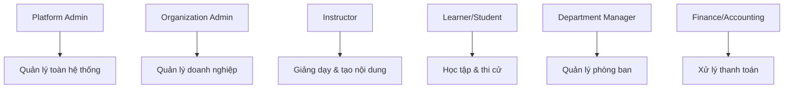

# Phân Tích Nghiệp Vụ Hệ Thống LMS

## 1. Tổng Quan Nghiệp Vụ

### 1.1 Mô Hình Kinh Doanh

Hệ thống LMS hỗ trợ **3 mô hình kinh doanh chính**:

1. **B2C (Business-to-Consumer)**
   - Học viên cá nhân tự đăng ký và thanh toán
   - Mua khóa học trực tiếp từ catalog
   - Thanh toán theo từng khóa học hoặc gói subscription

2. **B2B (Business-to-Business)**
   - Doanh nghiệp mua license theo số lượng (seat-based)
   - Quản lý pool license và phân bổ cho nhân viên
   - Thanh toán theo hợp đồng, có volume discount
   - Tracking tiến độ học tập của nhân viên

3. **Hybrid Learning**
   - Kết hợp học online (VOD - Video on Demand)
   - Học trực tiếp qua Zoom (Live Sessions)
   - Blended learning với cả hai phương thức

### 1.2 Các Bên Liên Quan (Stakeholders)



## 2. Phân Tích Chi Tiết Các Module Nghiệp Vụ

### 2.1 Quản Lý Người Dùng & Tổ Chức

#### 2.1.1 User Management
**Nghiệp vụ:**
- Đăng ký tài khoản (email verification)
- Đăng nhập/đăng xuất (JWT authentication)
- Quản lý profile (Learner Profile, Instructor Profile)
- Phân quyền theo role (Admin, Instructor, Student)

**Vấn đề cần giải quyết:**
- ✅ **Multi-tenancy**: Một user có thể thuộc nhiều organization
- ✅ **Role switching**: User có thể vừa là learner vừa là instructor
- ⚠️ **SSO Integration**: Tích hợp với Azure AD, Google Workspace cho B2B
- ⚠️ **Privacy & GDPR**: Quyền xóa dữ liệu cá nhân

#### 2.1.2 Organization Management
**Nghiệp vụ:**
- Tạo và quản lý organization (công ty, trường học)
- Phân cấp department (phòng ban, khoa)
- Cấu hình organization settings (branding, domain)
- Quản lý membership (vai trò trong tổ chức)

**Vấn đề cần giải quyết:**
- ✅ **Hierarchy**: Cấu trúc phân cấp phòng ban phức tạp
- ✅ **Isolation**: Dữ liệu giữa các organization phải tách biệt
- ⚠️ **White-labeling**: Tùy chỉnh giao diện theo từng organization

### 2.2 Quản Lý Khóa Học & Nội Dung

#### 2.2.1 Course Structure
**Cấu trúc phân cấp:**
```
Course (Khóa học)
  └── Course Module (Chương)
        └── Lesson (Bài học)
              └── Content Asset (Nội dung: video, PDF, SCORM)
```

**Nghiệp vụ:**
- Tạo và chỉnh sửa khóa học (draft mode)
- Publish/unpublish course
- Version control (lưu lại các phiên bản)
- Content upload (video, document, quiz)
- Preview course trước khi publish

**Vấn đề cần giải quyết:**
- ✅ **Content versioning**: Cập nhật nội dung không ảnh hưởng học viên đang học
- ✅ **Large file handling**: Upload video lớn (chunked upload, CDN)
- ⚠️ **SCORM compliance**: Hỗ trợ chuẩn SCORM 1.2/2004
- ⚠️ **DRM**: Bảo vệ video khỏi download trái phép
- ⚠️ **Accessibility**: Hỗ trợ subtitle, screen reader

#### 2.2.2 Class & Session Management
**Nghiệp vụ:**
- Tạo class (lớp học) từ course template
- Lên lịch session (buổi học) cho class
- Phân công instructor cho class
- Quản lý capacity (số lượng học viên tối đa)
- Phân chia seat: B2B reserved vs Public available

**Vấn đề cần giải quyết:**
- ✅ **Seat reservation**: Tránh overbooking khi nhiều user đăng ký cùng lúc
- ✅ **Capacity split**: Chia seat cho B2B và B2C
- ⚠️ **Waitlist**: Danh sách chờ khi hết chỗ
- ⚠️ **Auto-scaling**: Tự động mở class mới khi đầy

### 2.3 Enrollment & Learning Progress

#### 2.3.1 Enrollment Process
**Nghiệp vụ:**
- **B2C**: User mua course → Payment → Enrollment
- **B2B**: Admin assign license → Enrollment
- **Free course**: Direct enrollment
- Tracking enrollment source (payment, license, promotion)

**Vấn đề cần giải quyết:**
- ✅ **Concurrency**: Nhiều user đăng ký cùng lúc vào class có giới hạn
- ✅ **Idempotency**: Tránh duplicate enrollment
- ⚠️ **Enrollment expiry**: Hết hạn sau X ngày nếu không học
- ⚠️ **Transfer**: Chuyển enrollment sang class khác

#### 2.3.2 Progress Tracking
**Nghiệp vụ:**
- Track lesson completion (video watch time, document read)
- Track quiz attempts và scores
- Calculate course completion percentage
- Issue certificate khi hoàn thành

**Vấn đề cần giải quyết:**
- ✅ **VOD tracking**: Heartbeat mechanism để track video watch time
- ✅ **Completion criteria**: Định nghĩa điều kiện hoàn thành (80% video, pass quiz)
- ⚠️ **Resume playback**: Tiếp tục xem video từ vị trí đã dừng
- ⚠️ **Offline learning**: Sync progress khi học offline

### 2.4 Assessment & Certification

#### 2.4.1 Quiz & Assessment
**Nghiệp vụ:**
- Tạo quiz với nhiều loại câu hỏi (multiple choice, true/false, essay)
- Randomize questions và answers
- Time limit cho quiz
- Multiple attempts với retry policy
- Auto-grading và manual grading

**Vấn đề cần giải quyết:**
- ✅ **Question bank**: Tái sử dụng câu hỏi
- ✅ **Anti-cheating**: Randomize, time limit, proctoring
- ⚠️ **Adaptive testing**: Câu hỏi thay đổi theo trình độ
- ⚠️ **Peer review**: Học viên chấm bài cho nhau

#### 2.4.2 Certificate Management
**Nghiệp vụ:**
- Auto-issue certificate khi đạt điều kiện
- Generate PDF certificate với template
- Verification link (public URL để verify)
- Expiry date cho certificate (nếu cần recertification)

**Vấn đề cần giải quyết:**
- ✅ **Template customization**: Tùy chỉnh template theo organization
- ⚠️ **Blockchain verification**: Lưu hash trên blockchain
- ⚠️ **Badge system**: Digital badges (Open Badges standard)

### 2.5 B2B License & Seat Management

#### 2.5.1 License Pool
**Nghiệp vụ:**
- Organization mua license pool (X seats cho course Y)
- Admin phân bổ license cho learner
- Track used/available seats
- Expiry date cho license pool
- Reclaim license từ inactive users

**Vấn đề cần giải quyết:**
- ✅ **Seat limit enforcement**: Không cho assign vượt quá số seat
- ✅ **Expiry handling**: Auto-revoke khi hết hạn
- ⚠️ **Auto-assignment**: Tự động assign theo department/role
- ⚠️ **Seat transfer**: Chuyển seat giữa các users

#### 2.5.2 Reporting for B2B
**Nghiệp vụ:**
- Dashboard cho organization admin
- Learner progress report
- Completion rate by department
- Export report (Excel, PDF)
- Scheduled report (email hàng tuần)

**Vấn đề cần giải quyết:**
- ✅ **Real-time analytics**: Dashboard cập nhật real-time
- ⚠️ **Custom report builder**: Cho phép admin tạo report tùy chỉnh
- ⚠️ **Data export**: Tuân thủ data privacy khi export

### 2.6 Payment & Commerce

#### 2.6.1 Pricing Engine
**Nghiệp vụ:**
- Base price từ Product/PricePlan
- Apply campaign discount (flash sale, seasonal)
- Apply coupon code
- B2B volume discount (tier pricing)
- Tax calculation (VAT by region)
- Final price snapshot

**Quy trình tính giá:**
```
FinalPrice = BasePrice
  - GlobalDiscount
  - CampaignDiscount (best eligible hoặc stackable)
  - CouponDiscount (nếu stackable)
  - VolumeDiscount (B2B)
  + Tax (VAT/GST)
```

**Vấn đề cần giải quyết:**
- ✅ **Rule engine**: Flexible pricing rules
- ✅ **Audit trail**: Lưu lại cách tính giá
- ⚠️ **Currency conversion**: Multi-currency support
- ⚠️ **Price localization**: Giá khác nhau theo region

#### 2.6.2 Order & Payment
**Nghiệp vụ:**
- Create order với order items
- Payment gateway integration (Stripe, VNPay, PayPal)
- Payment status tracking (pending, completed, failed)
- Refund processing
- Invoice generation

**Vấn đề cần giải quyết:**
- ✅ **Reservation pattern**: Reserve seat khi checkout, release nếu payment fails
- ✅ **Idempotency**: Tránh duplicate payment
- ⚠️ **Partial refund**: Refund một phần order
- ⚠️ **Installment payment**: Trả góp cho B2B

#### 2.6.3 Campaign & Promotion
**Nghiệp vụ:**
- Flash sale với limited quantity
- Coupon code (single-use, multi-use)
- Referral program
- Bundle pricing (mua nhiều khóa giảm giá)
- Early bird discount

**Vấn đề cần giải quyết:**
- ✅ **Concurrency**: Tránh vượt quá usage limit của campaign
- ✅ **Stacking rules**: Định nghĩa campaign nào được stack
- ⚠️ **A/B testing**: Test hiệu quả của campaigns
- ⚠️ **Personalized offers**: Offer khác nhau cho từng user segment

### 2.7 Live Learning (Zoom Integration)

#### 2.7.1 Session Management
**Nghiệp vụ:**
- Create Zoom meeting khi tạo session
- Send meeting link cho enrolled learners
- Auto-start recording
- Fetch participants sau khi meeting kết thúc
- Auto-mark attendance

**Vấn đề cần giải quyết:**
- ✅ **Webhook handling**: Xử lý Zoom webhooks (meeting started, ended)
- ⚠️ **Breakout rooms**: Hỗ trợ breakout rooms cho group work
- ⚠️ **Polling**: Tích hợp Zoom polling vào quiz
- ⚠️ **Recording storage**: Lưu recording vào CDN

#### 2.7.2 Attendance Tracking
**Nghiệp vụ:**
- Attendance sheet cho mỗi session
- Auto-mark từ Zoom participants
- Manual override bởi instructor
- Attendance report
- Minimum attendance requirement

**Vấn đề cần giải quyết:**
- ✅ **Accuracy**: Đảm bảo attendance chính xác (join time, leave time)
- ⚠️ **Late join**: Xử lý học viên join muộn
- ⚠️ **Multiple devices**: User join từ nhiều device

### 2.8 Learning Path

**Nghiệp vụ:**
- Tạo learning path (chuỗi courses)
- Define prerequisites (course A trước course B)
- Track path progress
- Issue path certificate khi hoàn thành tất cả

**Vấn đề cần giải quyết:**
- ✅ **Dependency management**: Enforce prerequisites
- ⚠️ **Adaptive path**: Thay đổi path dựa trên performance
- ⚠️ **Path versioning**: Update path không ảnh hưởng learners đang học

### 2.9 Notification & Communication

**Nghiệp vụ:**
- Email notifications (enrollment, reminder, certificate)
- In-app notifications
- Push notifications (mobile app)
- Announcement từ instructor
- Discussion forum (optional)

**Vấn đề cần giải quyết:**
- ✅ **Template management**: Email templates có thể customize
- ⚠️ **Notification preferences**: User chọn loại notification nhận
- ⚠️ **Digest mode**: Gộp nhiều notification thành 1 email
- ⚠️ **Multi-language**: Notification theo ngôn ngữ user

### 2.10 Audit & Compliance

**Nghiệp vụ:**
- Audit log mọi thao tác quan trọng (who, when, what)
- Soft delete (không xóa thật)
- Change history (track changes to entities)
- Compliance reports (GDPR, SCORM)

**Vấn đề cần giải quyết:**
- ✅ **Audit trail**: Đầy đủ và tamper-proof
- ⚠️ **Data retention**: Policy xóa data sau X năm
- ⚠️ **Right to be forgotten**: GDPR compliance
- ⚠️ **Compliance certification**: ISO 27001, SOC 2

## 3. Các Vấn Đề Kỹ Thuật Quan Trọng

### 3.1 Concurrency & Race Conditions

**Vấn đề:**
- Nhiều user đăng ký cùng lúc vào class có giới hạn
- Flash sale với limited quantity
- Seat assignment trong license pool

**Giải pháp:**
```sql
-- Atomic update với optimistic locking
UPDATE classes
SET available_seats = available_seats - 1,
    version = version + 1
WHERE id = 'CLASS_123' 
  AND available_seats > 0
  AND version = @expected_version;
```

**Reservation Pattern:**
1. User click checkout → Create PendingOrder (RESERVED)
2. Reserve seat atomically
3. Payment success → COMPLETED + create Enrollment
4. Payment fail/timeout → Release seat (background job)

### 3.2 Scalability

**Challenges:**
- Large video files (CDN, chunked upload)
- Many concurrent users watching videos
- Real-time progress tracking
- Report generation for large datasets

**Solutions:**
- **CDN**: CloudFront, Cloudflare cho video streaming
- **Caching**: Redis cho frequently accessed data
- **Read replicas**: Separate read/write DB
- **Background jobs**: Async processing (Hangfire, RabbitMQ)
- **Pagination**: Cursor-based pagination cho large lists

### 3.3 Data Consistency

**Vấn đề:**
- Enrollment phải sync với Payment
- License assignment phải sync với Enrollment
- Certificate phải sync với Progress

**Giải pháp:**
- **Transactional outbox pattern**: Đảm bảo consistency
- **Domain events**: Decouple business logic
- **Saga pattern**: Distributed transactions cho complex workflows

### 3.4 Security

**Vấn đề:**
- Authentication & Authorization
- Data privacy (GDPR)
- Content protection (DRM)
- Payment security (PCI DSS)

**Giải pháp:**
- **JWT**: Stateless authentication
- **Role-based access control (RBAC)**
- **Data encryption**: At rest và in transit
- **Rate limiting**: Prevent abuse
- **Input validation**: Prevent injection attacks

## 4. Tổng Kết Các Vấn Đề Cần Ưu Tiên

### 4.1 Critical (Phải giải quyết ngay)
1. ✅ **Seat reservation & concurrency**: Tránh overbooking
2. ✅ **Pricing engine**: Tính giá chính xác và audit được
3. ✅ **License pool management**: Enforce seat limits
4. ✅ **Audit trail**: Đầy đủ và tamper-proof
5. ✅ **Payment integration**: Reliable và secure

### 4.2 High Priority (Quan trọng)
1. ⚠️ **VOD tracking**: Accurate progress tracking
2. ⚠️ **Zoom integration**: Seamless live learning
3. ⚠️ **Certificate generation**: Auto-issue và verify
4. ⚠️ **Reporting**: Real-time analytics cho B2B
5. ⚠️ **Multi-tenancy**: Data isolation

### 4.3 Medium Priority (Nên có)
1. ⚠️ **SSO integration**: Azure AD, Google Workspace
2. ⚠️ **SCORM compliance**: Support legacy content
3. ⚠️ **Learning path**: Structured learning
4. ⚠️ **Notification system**: Multi-channel
5. ⚠️ **White-labeling**: Branding cho organizations

### 4.4 Low Priority (Nice to have)
1. ⚠️ **Blockchain verification**: Certificate verification
2. ⚠️ **Adaptive learning**: AI-powered recommendations
3. ⚠️ **Gamification**: Badges, leaderboard
4. ⚠️ **Mobile app**: Native iOS/Android
5. ⚠️ **Offline learning**: Download content

## 5. Recommended Aggregates (Domain-Driven Design)

```mermaid
graph TB
    A[Identity/Profile] --> B[User, LearnerProfile, InstructorProfile]
    C[OrganizationContext] --> D[Organization, Department, Membership, LicensePool]
    E[CourseManagement] --> F[Course, Module, Lesson, ContentAsset]
    G[ClassManagement] --> H[Class, Session, InstructorAssignment]
    I[Enrollment] --> J[Enrollment, Progress, PathProgress]
    K[Assessment] --> L[Quiz, Question, Attempt, Score]
    M[AttendanceControl] --> N[AttendanceSheet, AttendanceRecord]
    O[Commerce] --> P[Order, OrderItem, Payment, Refund]
    Q[Campaign] --> R[Campaign, PromotionRule, Coupon, Usage]
    S[Certification] --> T[Certificate, Template]
    U[Notification] --> V[Notification, Template]
    W[Audit] --> X[AuditLog, ChangeHistory]
```



## 6. Kết Luận

Hệ thống LMS là một hệ thống phức tạp với nhiều nghiệp vụ đan xen. Các vấn đề quan trọng nhất cần giải quyết:

1. **Concurrency**: Đảm bảo data consistency khi có nhiều users
2. **Pricing**: Engine linh hoạt và audit được
3. **B2B**: License management và reporting
4. **Hybrid Learning**: Tích hợp VOD và Zoom seamlessly
5. **Scalability**: Xử lý large files và many concurrent users
6. **Security**: Bảo vệ data và content

Với kiến trúc **Clean Architecture** và **Domain-Driven Design**, hệ thống sẽ dễ maintain và mở rộng trong tương lai.
