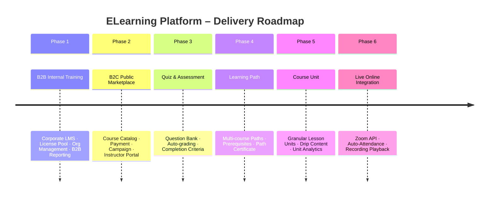
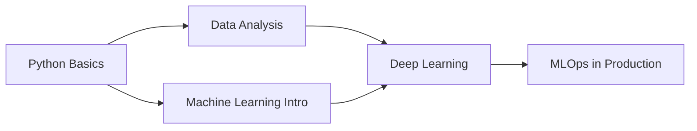

# Project Phases – ELearning Platform

## Roadmap Overview



---

## Phase 1 – B2B Internal Training (Corporate LMS)

**Goal**: Provide a private training platform for enterprises. The organization is the customer; employees are learners.

### Core Features

| Module | Features |
|---|---|
| Organization Management | Create org, department hierarchy, branding config, org settings |
| User & Role | Invite employees, assign roles (Org Admin / Department Manager / Learner) |
| SSO Integration | Azure AD / Google Workspace login for enterprise users |
| Course Content | Upload video, PDF, SCORM; structured as Course → Module → Lesson |
| License Pool | Org purchases seats; admin allocates seats to employees |
| B2B Enrollment | Admin assigns courses to employees by department or individually |
| Progress Tracking | Track completion per learner, per department, per course |
| B2B Reporting | Dashboard: completion rate, time-spent, learner progress; export Excel/PDF |
| Notifications | Enrollment confirmation, learning reminders, completion alerts |

### Domain Entities

```
Organization → Department[] → Membership[]
LicensePool (OrgId, CourseId, TotalSlots, UsedSlots, ExpiryDate)
  └── LicenseAssignment (PoolId, LearnerId, AssignedAt, Status)
        └── Enrollment (UserId, ClassId, SourceType=License)
              └── Progress (LessonId, CompletionPct, LastAccessedAt)
```

### Key Domain Rules
- `LicensePool.UsedSlots >= TotalSlots` → block new assignments
- Soft-delete license assignment when seat is reclaimed from inactive user
- Data isolation: queries always scope to `OrganizationId` (multi-tenancy)

### Deliverables
- [ ] Auth + SSO (Azure AD / Google Workspace via OAuth/SAML)
- [ ] Organization CRUD + department hierarchy
- [ ] Invite flow: email invitation → register → join org
- [ ] Course builder (video upload + CDN, PDF, SCORM)
- [ ] License pool management (create, assign, reclaim, expiry)
- [ ] B2B enrollment flow (admin assigns → learner gets notified)
- [ ] Progress tracking engine (heartbeat for VOD, lesson completion)
- [ ] B2B reporting dashboard + export
- [ ] Notification service (email + in-app)

### Acceptance Criteria
- Admin can create an org, add employees, and assign courses via license pool
- Employees log in (SSO), access assigned courses, and track their own progress
- Manager views completion rate broken down by department
- License pool blocks assignments when all seats are used

---

## Phase 2 – B2C Public Marketplace

**Goal**: Open the platform to public users – self-registration, course browsing, purchase, and self-paced learning.

### Core Features

| Module | Features |
|---|---|
| Course Catalog | Browse, search, filter by category / tag / level / price |
| Public Registration | Register via email, Google, or Facebook OAuth |
| Pricing Engine | Base price, free/paid, volume discount, bundle pricing |
| Payment Gateway | Stripe / VNPay; order → payment → auto-enrollment |
| Campaign & Promotions | Flash sale, percentage/fixed discount, time-limited campaigns |
| Coupon System | Single-use, multi-use codes; stackable rules |
| Refund Management | Full and partial refund; configurable refund window |
| Instructor Portal | Create/manage courses, view enrolled learners, track revenue |
| Course Review & Rating | Learners rate and review completed courses |
| Learner Dashboard | My courses, progress overview, certificates earned |

### Pricing Calculation

```
FinalPrice = BasePrice
  − GlobalDiscount
  − BestEligibleCampaignDiscount  (or stackable campaigns)
  − CouponDiscount                (if stackable)
  − VolumeDiscount                (B2B tier, n/a for B2C)
  + VAT / Tax                     (by region)
```

> All pricing steps are persisted in `PriceSnapshot` for audit.

### Reservation Pattern (Concurrency)

```
User clicks Checkout
  → Create PendingOrder (status = RESERVED, ExpiresAt = +15min)
  → Reserve seat atomically: UPDATE classes SET available_seats = available_seats - 1
                                WHERE id = ? AND available_seats > 0
  → Reserve campaign usage atomically (if applicable)
  → Payment success → Order = COMPLETED → create Enrollment
  → Payment fail / timeout → background job releases seat + campaign usage
```

### Domain Entities

```
Product → PricePlan[]
Order (UserId, OrganizationId, Status, TotalAmount)
  └── OrderItem (ProductId, Qty, UnitPrice, DiscountApplied)
  └── Payment (Gateway, Amount, Status, GatewayRef)
  └── Refund (Amount, Reason, RefundedAt)
Campaign → PromotionRule[] → Coupon[] → CampaignUsage[]
PriceSnapshot (OrderItemId, BasePrice, Rules[], FinalPrice)
```

### Deliverables
- [ ] Public course catalog with search + filter
- [ ] B2C self-registration (email + OAuth)
- [ ] Shopping cart + checkout flow
- [ ] Stripe + VNPay payment integration
- [ ] Pricing engine (campaign, coupon, VAT)
- [ ] Reservation pattern with TTL + background release job
- [ ] Refund processing
- [ ] Instructor portal (course management + revenue dashboard)
- [ ] Course review & rating system
- [ ] Learner dashboard (My Courses, progress, certificates)

### Acceptance Criteria
- User registers, browses catalog, purchases a course, and is auto-enrolled
- Flash sale coupon applies correctly; cannot exceed usage limit under concurrent load
- Instructor views enrolled learners and revenue breakdown
- Refund request triggers payment gateway reversal and removes enrollment

---

## Phase 3 – Quiz & Assessment Integration

**Goal**: Attach assessments to lessons and modules; define completion criteria; provide auto-grading and analytics.

### Core Features

| Module | Features |
|---|---|
| Question Bank | Create and categorize questions; reuse across multiple quizzes |
| Quiz Builder | Attach quiz to a lesson/module; configure settings |
| Question Types | Multiple choice, true/false, fill-in-the-blank, short essay |
| Quiz Settings | Time limit, shuffle questions/answers, max attempts, passing score |
| Attempt & Grading | Auto-grade objective types; manual grade for essay |
| Result & Feedback | Show score, correct answers, explanations after submission |
| Completion Criteria | Define lesson completion: e.g., watch ≥ 80% video AND pass quiz ≥ 70% |
| Anti-cheat Basics | Shuffle options, single-window enforcement, time pressure |
| Quiz Analytics | Score distribution, question difficulty, common wrong answers |

### Quiz Hierarchy

```
Lesson
  └── Quiz (type: pre / formative / summative)
        └── Question[] (from QuestionBank)
              └── Option[] (for MC / TF)

Learner → Attempt
  └── AttemptAnswer[] (QuestionId, SelectedOptionId / TextAnswer)
  └── Score (Raw, Percentage, Passed, GradedAt)
```

### Completion Criteria Engine

```
LessonCompletion = (VideoWatchPct >= threshold) AND (QuizScore >= passingScore)

CourseCompletion = ALL required lessons completed
PathCompletion   = ALL required courses completed
```

### Domain Entities
- `Quiz`: `LessonId`, `Title`, `TimeLimitMin`, `PassingScore`, `MaxAttempts`, `ShuffleQuestions`
- `Question`: `QuizId` or `BankId`, `Type`, `Text`, `Points`
- `QuestionOption`: `QuestionId`, `Text`, `IsCorrect`, `Explanation`
- `Attempt`: `UserId`, `QuizId`, `StartedAt`, `SubmittedAt`, `Status`
- `AttemptAnswer`: `AttemptId`, `QuestionId`, `SelectedOptionId`, `TextAnswer`
- `Score`: `AttemptId`, `RawScore`, `MaxScore`, `Percentage`, `Passed`

### Deliverables
- [ ] Question bank CRUD (with tags/category)
- [ ] Quiz builder (attach to lesson, configure settings)
- [ ] Multiple question types with option management
- [ ] Auto-grading engine (MC, TF, fill-in)
- [ ] Manual grading interface (essay)
- [ ] Attempt management with retry policy enforcement
- [ ] Score + answer feedback UI for learner
- [ ] Completion criteria engine (video % + quiz pass)
- [ ] Quiz analytics dashboard for instructor

### Acceptance Criteria
- Instructor creates a quiz with mixed question types, attached to a lesson
- Learner submits quiz; system auto-grades and shows score with feedback
- Lesson is only marked complete when video threshold AND quiz pass are met
- Instructor sees score distribution and which questions were most failed

---

## Phase 4 – Learning Path

**Goal**: Organize multiple courses into structured learning journeys with prerequisites, progress tracking, and path-level certification.

### Core Features

| Module | Features |
|---|---|
| Path Builder | Create learning path, define ordered course items |
| Prerequisites | Define "Course A must be completed before Course B" |
| Path Progress | Aggregate progress across all path items |
| Path Certificate | Auto-issue certificate when all required items are completed |
| B2B Path Assignment | Org admin assigns a full path to a department or individual |
| Recommended Paths | Suggest paths based on learner role or goal |

### Path Dependency Example



### Data Structure

```
LearningPath (Id, Title, Description, IsPublished)
  └── PathItem[] (PathId, CourseId, Order, IsRequired, PrerequisiteItemId)

PathProgress (UserId, PathId, CompletedItems, TotalItems, Pct, CompletedAt)
  └── derives from Enrollment.Progress per course in path

Certificate (UserId, SourceType=Path, SourceId=PathId, IssuedAt)
```

### Domain Rules
- Validate path items form a **DAG** (no circular prerequisites) on save
- `PathItem` is unlocked only when its `PrerequisiteItemId` course is completed
- Path certificate issued by domain event `PathCompleted`

### Domain Entities
- `LearningPath`: `Title`, `Description`, `IsPublished`, `CreatedBy`
- `PathItem`: `PathId`, `CourseId`, `Order`, `IsRequired`, `PrerequisiteItemId`
- `PathProgress`: `UserId`, `PathId`, `CompletedItemCount`, `TotalItemCount`, `CompletedAt`

### Deliverables
- [ ] Learning path CRUD with item ordering
- [ ] Prerequisite configuration per path item
- [ ] DAG validation on save (prevent circular dependencies)
- [ ] Prerequisite enforcement (block learner from starting locked course)
- [ ] Path progress aggregation
- [ ] Path certificate auto-issue on completion
- [ ] B2B: assign learning path to department
- [ ] Learner: My Learning Paths dashboard with progress view

### Acceptance Criteria
- Admin creates a path with ordered courses and prerequisites
- Learner cannot start Course B if Course A is not yet completed
- System auto-issues path certificate when all required courses are passed
- Org admin assigns path to an entire department; all members are enrolled

---

## Phase 5 – Course Unit (Granular Lesson Structure)

**Goal**: Break lessons into individual learning units (video, article, quiz, code exercise, file) with independent completion tracking, drip scheduling, and unit-level analytics.

### Core Features

| Module | Features |
|---|---|
| Course Unit Types | Video, Article, Quiz (ref), Code Exercise, File Download, External Link |
| Unit Ordering | Drag-and-drop ordering; required vs optional units |
| Unit Completion | Track completion per unit (not just per lesson) |
| Drip Content | Unlock units on a schedule (e.g., Unit 3 available after Day 3) |
| Micro-progress | Granular progress bar within a lesson |
| Unit Analytics | Completion rate, average time spent, drop-off rate per unit |

### Revised Content Hierarchy

```
Course
  └── CourseModule  (Chapter 1, 2, …)
        └── Lesson  (Lesson 1.1, 1.2, …)
              └── CourseUnit[]  (Video intro | Reading | Quiz | Assignment | …)
                    └── ContentAsset  (file ref, video ref, quiz ref)
```

### Comparison: Phase 1 vs Phase 5

| Aspect | Phase 1 Structure | Phase 5 Structure |
|---|---|---|
| Content depth | Lesson → ContentAsset | Lesson → Unit[] → ContentAsset |
| Completion granularity | Per lesson | Per unit + per lesson |
| Content variety | One type per lesson | Multiple unit types in one lesson |
| Progress tracking | Lesson-level heartbeat | Unit-level heartbeat + lesson aggregation |
| Scheduling | Publish all at once | Per-unit drip scheduling |

### Domain Entities
- `CourseUnit`: `LessonId`, `Title`, `Type`, `Order`, `IsRequired`, `UnlockAfterDays`, `ContentAssetId`
- `UnitProgress`: `UserId`, `UnitId`, `StartedAt`, `CompletedAt`, `TimeSpentSec`, `WatchPct`

### Migration Strategy
> Phase 1 creates `Lesson → ContentAsset` directly.
> Phase 5 migration wraps each existing `ContentAsset` into a `CourseUnit` (Order=1, IsRequired=true) — backward-compatible, no data loss.

### Deliverables
- [ ] `CourseUnit` entity + migration script (wrap existing content assets)
- [ ] Unit CRUD within lesson builder (all types)
- [ ] Drag-and-drop unit ordering
- [ ] Drip content scheduling configuration
- [ ] Unit-level progress tracking (heartbeat extended)
- [ ] Lesson completion derived from unit completion
- [ ] Unit analytics dashboard for instructor
- [ ] Learner: unit checklist UI within lesson view

### Acceptance Criteria
- Instructor creates a lesson with 3 units: Video → Reading Article → Quiz
- Learner completes each unit independently; lesson progress bar reflects unit completions
- Drip content hides Unit 3 until the scheduled unlock date
- Instructor views drop-off rate per unit to identify weak content spots

---

## Phase 6 – Live Online Platform Integration

**Goal**: Integrate a live video conferencing platform (Zoom / BigBlueButton) into the LMS; automate meeting creation, attendance tracking, and recording playback.

### Integration Levels

| Level | Description | Complexity |
|---|---|---|
| 1 – Link embed | Store Zoom meeting URL in session; display to enrolled learners | Low |
| 2 – Auto-create meeting | Call Zoom API when session is created; store `MeetingId` | Medium |
| 3 – Auto-attendance | Receive `meeting.ended` webhook; map participants → learners | High |
| 4 – Recording playback | Download cloud recording → upload CDN → attach to lesson | Very High |

> **Recommended start**: Level 2, then Level 3, then Level 4.

### Automated Session Flow

```
Admin creates Session (Type = Online)
  │
  ▼
[Domain Event: SessionCreated]
  → Infrastructure: call Zoom API → create meeting
  → Persist ZoomMeetingId, JoinUrl, HostUrl on Session
  │
  ▼
System sends meeting link to enrolled learners (email + in-app)
  │
  ▼
Zoom session runs
  │
  ▼
Zoom Webhook: meeting.ended
  → Fetch participant report (Zoom Reports API)
  → Map email/name → LMS UserId
  → Upsert AttendanceRecord (JoinTime, LeaveTime, DurationMin)
  → Raise LessonAttendanceRecorded event
  │
  ▼
Zoom Webhook: recording.completed
  → Download recording → upload to CDN (S3 / Azure Blob)
  → Create ContentAsset (Type = Recording, Url = CDN url)
  → Attach to Session / Lesson for playback
```

### Attendance Tracking

```
Session
  └── AttendanceSheet (SessionId, CreatedAt)
        └── AttendanceRecord (UserId, JoinTime, LeaveTime, DurationMin,
                              Source=Zoom|Manual, Status=Present|Absent|Late)
```

- **Auto-mark**: sourced from Zoom participant report
- **Manual override**: instructor can correct attendance
- **Minimum attendance**: configurable threshold (e.g., ≥ 60% of session duration)

### Alternative Platforms

| Platform | Best For | Trade-off |
|---|---|---|
| **Zoom** | Familiar, enterprise-grade, rich API | Cost, vendor dependency |
| **BigBlueButton** (self-hosted) | Full control, education-focused, free OSS | DevOps overhead, media server infra |
| **Jitsi** (self-hosted) | Lowest cost, quick MVP | Limited API, fewer features |
| **Google Meet API** | Google Workspace SSO ecosystem | Less feature-rich API |
| **Microsoft Teams** | Microsoft 365 enterprise orgs | Complex permission model |
| **Agora / Vonage** | Deeply embedded in-app video call | Higher dev effort, per-minute cost |

### Domain Entities
- `Session`: add `Type` (Online/Offline/Hybrid), `ZoomMeetingId`, `ZoomJoinUrl`, `ZoomHostUrl`, `RecordingUrl`
- `AttendanceSheet`: `SessionId`, `CreatedAt`, `AutoMarkedAt`
- `AttendanceRecord`: `SheetId`, `UserId`, `JoinTime`, `LeaveTime`, `DurationMin`, `Source`, `Status`
- `ZoomWebhookLog`: `EventType`, `Payload`, `ReceivedAt`, `ProcessedAt` *(for debugging)*

### Security Considerations
- Validate Zoom webhook signature (`X-Zm-Signature`) before processing
- Store Zoom OAuth tokens encrypted; refresh proactively before expiry
- Scope meeting join URLs — do not expose host URL to learners
- CDN recording URLs: signed/time-limited (pre-signed S3 URLs)

### Deliverables
- [ ] Zoom OAuth App setup + token storage + refresh logic
- [ ] `SessionCreated` domain event → Zoom API: create meeting
- [ ] Store `ZoomMeetingId`, `JoinUrl`, `HostUrl` on Session
- [ ] Auto-send meeting link to enrolled learners (email + in-app)
- [ ] Zoom webhook endpoint + signature validation
- [ ] `meeting.ended` webhook → fetch participants → auto-mark attendance
- [ ] Manual attendance override UI for instructor
- [ ] `recording.completed` webhook → download → CDN upload → attach to lesson
- [ ] Recording playback in lesson viewer
- [ ] Attendance report per session (present / absent / late)
- [ ] Session reminder notifications (24h + 1h before)

### Acceptance Criteria
- Creating a session automatically generates a Zoom meeting; enrolled learners receive the join link
- After the session ends, attendance is auto-marked from Zoom participant data within 5 minutes
- Instructor can manually correct any attendance record
- Cloud recording appears in the lesson within 15 minutes of the session ending
- Webhook events are idempotent (replaying the same event does not duplicate records)

---

## Feature Matrix by Phase

| Feature | Ph.1 B2B | Ph.2 B2C | Ph.3 Quiz | Ph.4 Path | Ph.5 Unit | Ph.6 Live |
|---|:---:|:---:|:---:|:---:|:---:|:---:|
| User Auth + SSO | ✅ | ✅ | — | — | — | — |
| Organization + Department | ✅ | — | — | — | — | — |
| License Pool (B2B seats) | ✅ | — | — | — | — | — |
| Course Builder (Module → Lesson) | ✅ | ✅ | — | — | — | — |
| Course Unit (granular) | — | — | — | — | ✅ | — |
| Drip Content | — | — | — | — | ✅ | — |
| Payment + Commerce | — | ✅ | — | — | — | — |
| Campaign & Coupon | — | ✅ | — | — | — | — |
| Quiz & Auto-grading | — | — | ✅ | — | ✅ | — |
| Question Bank | — | — | ✅ | — | — | — |
| Completion Criteria Engine | ✅ (basic) | ✅ | ✅ | ✅ | ✅ | — |
| Learning Path + Prerequisites | — | — | — | ✅ | — | — |
| Certificate (course) | ✅ | ✅ | ✅ | — | — | — |
| Certificate (path) | — | — | — | ✅ | — | — |
| Zoom / Live Session | — | — | — | — | — | ✅ |
| Auto-Attendance (Zoom) | — | — | — | — | — | ✅ |
| Recording Playback | — | — | — | — | — | ✅ |
| Reporting & Analytics | ✅ | ✅ | ✅ | ✅ | ✅ | ✅ |
| Notification System | ✅ | ✅ | — | — | — | ✅ |

---

## Risk Register by Phase

| Phase | Key Risk | Mitigation |
|---|---|---|
| Ph.1 B2B | SSO integration varies per enterprise IdP | Standardize on OAuth 2.0 / SAML; implement Azure AD first, abstract the rest |
| Ph.2 B2C | Seat/campaign concurrency under flash sale load | Atomic DB updates + reservation TTL + Redis for hot-path contention |
| Ph.3 Quiz | Academic dishonesty | Shuffle questions/options, time limit, limit tab-switching; advanced proctoring in later phase |
| Ph.4 Path | Circular prerequisite chains | Validate DAG on every save; reject cycles at application layer |
| Ph.5 Unit | Breaking progress tracking when wrapping existing content | Migration script wraps assets into default units; run smoke tests before deploy |
| Ph.6 Live | Zoom participant ≠ LMS user identity | Match by email first; fallback to display-name fuzzy match; always allow manual override |
| Ph.6 Live | Recording webhook delay / failure | Idempotent handler + retry queue; manual recording upload fallback |

---

## Cross-Cutting Concerns (All Phases)

| Concern | Approach |
|---|---|
| **Audit Trail** | Every write operation records `CreatedBy`, `UpdatedBy`, `CreatedAt`, `UpdatedAt`; `AuditLog` entity for sensitive actions |
| **Soft Delete** | All entities use `IsDeleted` flag; hard delete only on explicit GDPR request |
| **Multi-tenancy** | All queries scoped by `OrganizationId`; row-level filtering in `DbContext` |
| **Background Jobs** | Hangfire for: seat release, certificate generation, report export, recording download |
| **Domain Events** | MediatR `INotification` for: `EnrollmentCreated`, `LessonCompleted`, `QuizPassed`, `PathCompleted`, `SessionCreated`, `AttendanceMarked` |
| **Caching** | Redis for: course catalog, price plans, active campaigns; TTL per entity type |
| **Observability** | Serilog + OpenTelemetry; correlation ID on every request; structured logs to Seq / Datadog |

---

## Related Documents

| Document | Description |
|---|---|
| [`erd.md`](./erd.md) | Full entity-relationship diagram (B2B + B2C + Hybrid) |
| [`business-analysis.md`](./business-analysis.md) | Detailed business requirements per module |
| [`advanced-architecture-notes.md`](./advanced-architecture-notes.md) | Pricing engine, reservation pattern, Zoom events, seat management |
| [`sprint-plan.md`](./sprint-plan.md) | Sprint-by-sprint task breakdown (Scrum, 2-week sprints) |
| [`project-structure.md`](./project-structure.md) | Folder layout for .NET Clean Architecture + Angular |
| [`src/README.md`](../src/README.md) | High-level build plan and technology choices |
